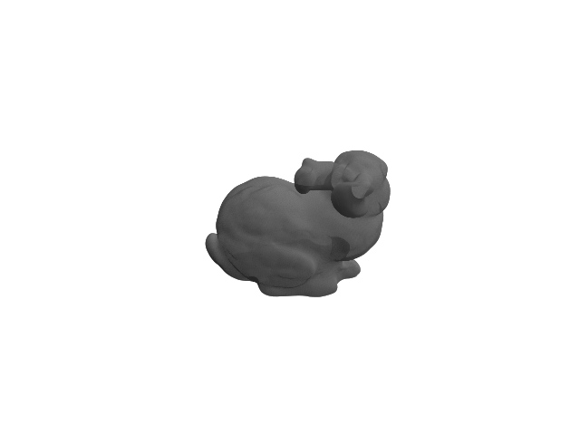
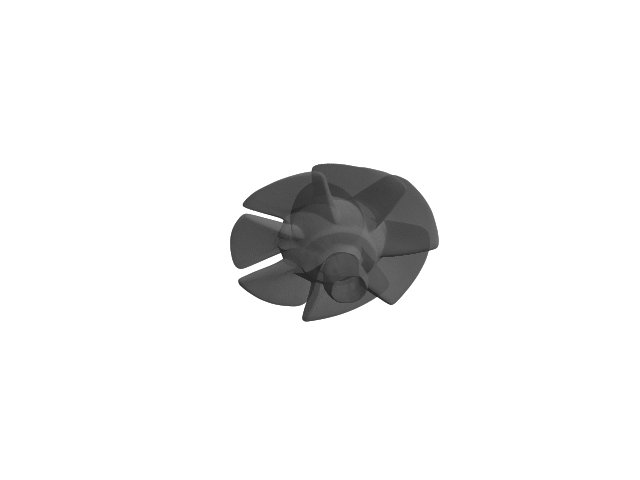
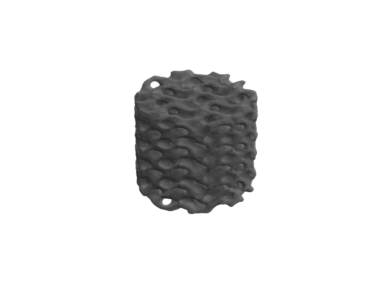

# Implicit Representation for Octree-mesh construction
This repository contains the code and resources for representing CAD (Computer-Aided Design) geometry using Signed Distance Functions (SDFs).


## Overview

The repo is designed to take any geometry files supported by `trimesh` package, it can handle distributed geometries across different files (overview `datagenerator/data_generator.py`). Only Fully connected network with skip-in and geometric initialization is supported.


## Installation


```bash
git clone https://github.com/username/sdf-representation.git
cd sdf-representation
conda env create -f environment.yaml
conda activate sdf
```

## Configuration 

Example of the configuration file is in the ```tests/test.ini``` file. Make changes as required to sample, train and post-process.

## Running 

```bash
mkdir your_folder && cd your_folder
cp $(pwd)/sdf-representation/tests/test.ini .
```
Make changes to the ```test.ini``` file and then run

```bash
python $(pwd)/sdf-representation/main.py test.ini
```


## Reconstructions

  